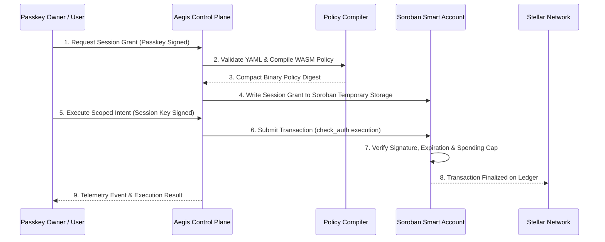
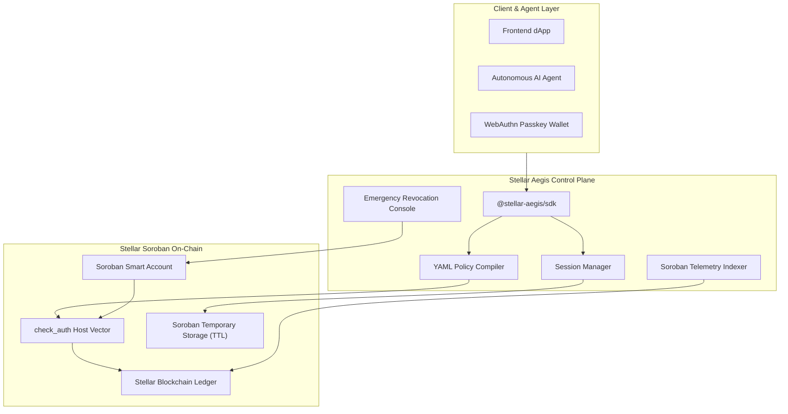

<div align="center">
  
  <h1>Stellar Aegis</h1>
  <p>Authorization Control Plane for Stellar Smart Accounts.</p>

  <a href="https://stellar-aegis.vercel.app"></a>
  
  
  
  
</div>

---

Stellar Aegis is an **Authorization Control Plane** engineered for Stellar Smart Accounts (Soroban Protocol 15+).

Aegis brings granular session policies, passkey-native authentication, and lifecycle-aware authorization to Stellar Smart Accounts — without altering native Soroban trust models or replacing existing Smart Account contracts.

> [!IMPORTANT]
> **Architectural Boundary**: Stellar Aegis is **not a wallet**, **not a new Smart Account contract**, and **not a Passkey SDK**. Aegis operates strictly outside the direct execution path as an operational control plane. Absolute security enforcement remains 100% on-chain inside the Smart Account's native Soroban `check_auth` host vector.

[Live Demo](http://localhost:3000) · [Developer Documentation](http://localhost:3000/docs/simple-guide) · [Architectural Decision Records (ADRs)](http://localhost:3000/docs/adr) · [Threat Model Spec](http://localhost:3000/docs/threat-model)

---

## What Is Stellar Aegis?

Most dApps building on Stellar Smart Accounts encounter the exact same operational friction: building session key lifecycles, velocity spend caps, emergency revocation circuit breakers, and telemetry indexers from scratch.

Stellar Aegis solves this by introducing a **Separation of Enforcement & Lifecycle**:

```text
[ Callers / Wallets / AI Agents ]
              │
              ▼
  [ STELLAR AEGIS CONTROL PLANE ]  <── Operational Lifecycle (Sessions, Policies, Revocation)
              │
              ▼
   [ SOROBAN SMART ACCOUNT ]       <── Absolute Security Enforcement (check_auth)
              │
              ▼
     [ STELLAR BLOCKCHAIN ]
```

- **Smart Account (On-Chain)**: Holds absolute security enforcement. Evaluates signatures, validates session IDs, and checks spending limits inside Soroban `check_auth`.
- **Stellar Aegis (Off-Chain)**: Manages operational lifecycles surrounding Smart Accounts. Compiles human-readable policy YAML, issues temporary session tokens, monitors Soroban events, and triggers emergency revocation.

---

## Core Flow



---

## Architecture Overview



### Stack & Primitives

- **Framework:** Next.js 15 (App Router), React 19, Tailwind CSS.
- **Smart Contracts:** Soroban Rust SDK, Custom Account Trait, `check_auth` Host Vector.
- **Key Standards:** WebAuthn / Passkeys (FIDO2), Ed25519 Session Keys.
- **Storage Strategy:** Soroban Temporary Storage (automatic ledger TTL decay) & Event Indexing.
- **Internationalization (i18n):** Full bilingual support (English `EN` & Bahasa Indonesia `ID`).

---

## Core Features

### 🔑 1. Delegated Session Lifecycles
- Create, rotate, inspect, and expire temporary delegated session keys.
- Bounded scopes with explicit expiration timestamps and contract allowlists.
- Leveraging Soroban Temporary Storage for zero-waste state auto-reclamation.

### 📜 2. Human-Readable Policy Compiler
- Define velocity spend limits and time locks in clean YAML syntax.
- Compiles policies into lightweight binary data structures evaluated deterministically inside `check_auth`.

### 🚨 3. Emergency Circuit Breaker (Revocation)
- Single-click emergency revocation flags written directly to Smart Account storage.
- Safely strip delegated capabilities from compromised AI agents without re-keying the main Passkey owner.

### 📊 4. Real-Time Observability & Explainability
- Index Soroban events to track active session counts, sponsor balance, and transaction velocity.
- Simulate transactions off-chain to provide human-readable error explanations when `check_auth` fails.

---

## Technical Specifications & Documentation

The project includes deep-dive architectural specifications built from first principles:

| Specification | Document | Description |
| --- | --- | --- |
| **Simple Overview** | [DOC-00](src/app/docs/[[...slug]]/page.tsx) | Plain-language introduction and corporate analogy |
| **Project Context** | [DOC-01](src/app/docs/[[...slug]]/page.tsx) | High-level control plane thesis and positioning |
| **Problem Statement** | [DOC-02](src/app/docs/[[...slug]]/page.tsx) | Operational friction analysis in Soroban dApps |
| **Policy Model** | [DOC-07](src/app/docs/[[...slug]]/page.tsx) | YAML policy format & deterministic compiler |
| **Session Model** | [DOC-08](src/app/docs/[[...slug]]/page.tsx) | Session state machine & TTL decay spec |
| **Storage Model** | [DOC-13](src/app/docs/[[...slug]]/page.tsx) | On-chain state minimization vs off-chain indexes |
| **Threat Model** | [DOC-14](src/app/docs/[[...slug]]/page.tsx) | Security assumptions & attack mitigations |
| **Integration Guide** | [DOC-15](src/app/docs/[[...slug]]/page.tsx) | Soroban Rust Smart Account implementation code |
| **ADR Log** | [DOC-19](src/app/docs/[[...slug]]/page.tsx) | Architectural Decision Records (ADR-001 & ADR-002) |

---

## Local Development

### Prerequisites

- Node.js 20 or later
- npm or pnpm
- Rust & Cargo (for Soroban contract builds)
- Stellar CLI v22+

### Running the App

```bash
# Clone the repository
git clone https://github.com/sayyidusy15/stellar-aegis.git
cd stellar-aegis

# Install dependencies
npm install

# Start development server
npm run dev
```

Open your browser at:
```text
http://localhost:3000
```

### Building for Production

```bash
npm run build
```

---

## Project Structure

```text
stellar-journey/
├── src/
│   ├── app/
│   │   ├── docs/[[...slug]]/   # Dynamic bilingual documentation routes
│   │   ├── layout.tsx           # Root layout & providers
│   │   ├── page.tsx             # Storytelling-first Landing Page (10 sections)
│   │   └── globals.css          # Design system & dark theme utilities
│   ├── components/
│   │   ├── monitor/             # Landing page components (Hero, Problem, Solution, etc.)
│   │   ├── Navbar.tsx           # Documentation header with EN/ID language switcher
│   │   ├── Sidebar.tsx          # Docs tree navigation with active #FF4747 indicators
│   │   └── SearchModal.tsx      # Multi-language docs search modal
│   ├── context/
│   │   └── LanguageContext.tsx  # React Context for global EN/ID state
│   └── data/
│       ├── docs.ts              # Primary documentation data (Indonesian)
│       ├── docsEn.ts            # English documentation translation dataset
│       └── i18n.ts              # Localized UI string dictionary
├── public/
│   ├── logo-aegis-2.png         # Main Aegis logo asset
│   └── mesh-gradient/           # High-resolution visual backgrounds
├── README.md                    # Project README
└── tailwind.config.ts           # Design tokens & color system
```

---

## License

Built for the Stellar & Soroban Ecosystem. Released under the [MIT License](LICENSE).
